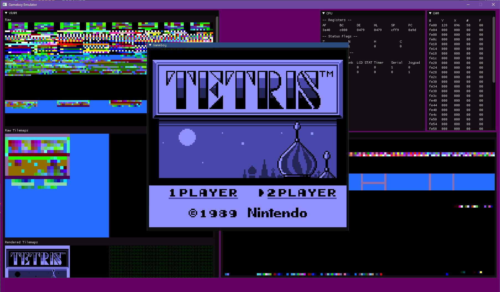

# yabGBE
(pronounced yab G. B. E.)

yabGBE stands for "Yet another bad gameboy emulator" and it already
perfectly encapsulates what this is. This emulator is unfinished, missing a lot of features and the few features that are implemented seem to be of questionable quality.

This is my first ever emulator programming project I tackled all by myself, without looking at explicit tutorials. I only used hardware docs and the gbdev wiki to get all my informations and knowledge.

Anyways, here is my emulator emulating tetris

